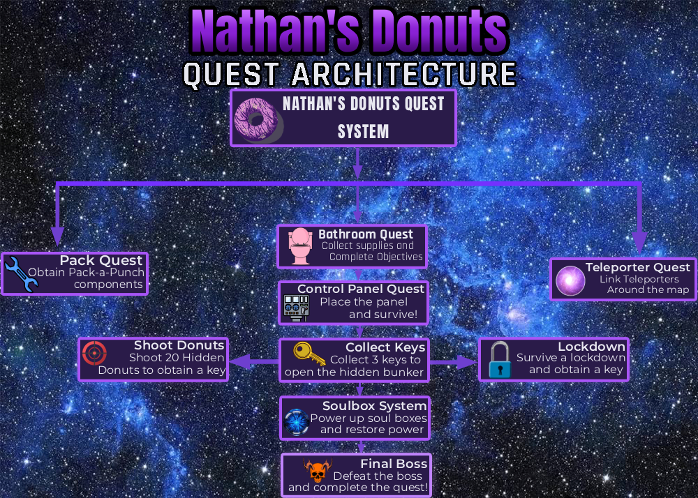
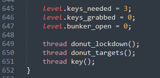

# BO3-GSC-Mod-Library

A collection of custom GSC/CSC gameplay systems, scripting, and level design developed for Call of Duty: Black Ops III Zombies. This repository contains the source code and assets for *Nathan's Donuts and Ethan's Dungeon,* featuring event-driven gameplay, quest systems, interactive mechanics, dynamic lighting, environmental design and custom enemy behavior.

## Level Design & Environmental Lighting

| Ethan's Dungeon: Main Chamber | Ethan's Dungeon: Cavern & Fog |
| :---: | :---: |
|  |  |

### *Nathan's Donuts* — Project Impact
  

| Metric |  Result |
|---|---:|
| Total Players |**6,463+** |
| Player Views |**20,079+** |
| Total Favorites |**258** |
| Positive Rating |**80%** |

### Nathan's Donuts Overview:
*Nathan's Donuts* is a fully playable custom Call of Duty: Black Ops III Zombies map developed using the Black Ops III Mod Tools. I designed and implemented the map's gameplay systems, scripted interactive quests and mechanics, along with custom enemy behavior using GSC.

### Quest Architecture

The quest is structured as a sequence of interconnected objectives, with branching gameplay tasks resulting in a final boss encounter.

 

### Technical Implementation

— __Multi-Stage Quest System:__ Designed and implemented a multi-stage quest system consisting of interconnected objectives, player interactions, and progression events

— __Event-Driven Gameplay:__ Connected player actions and entity interactions to scripted events that advance quest progression.

— __Custom Boss Encounter:__ Developed a fully scripted final boss encounter involving multiple objectives, enemy behaviors, and gameplay events.

— __Interactive Systems:__ Implemented custom interactions for environmental objects, doors, teleporters, and quest-related mechanics.

— __Custom Weapon & Perk Systems:__ Integrated custom gameplay functionality with base game weapons and perk systems.

— __Custom Jukebox Script:__ Developed a music-selection system supporting song selection and player-controlled song changes.

## Nathan's Donuts — Code Implementations

The Nathan's Donuts Main Quest is structured as a sequence of interconnected stages, with each stage responsible for a specific objective and progression state. Shared level variables track important conditions, allowing individual systems to determine when their requirements have been met and when the next stage of the quest can be activated.

 

 ### *Nathan's Donuts* Final Boss Gameplay
https://github.com/user-attachments/assets/27906294-3969-4f47-8fc7-24c935eae717

