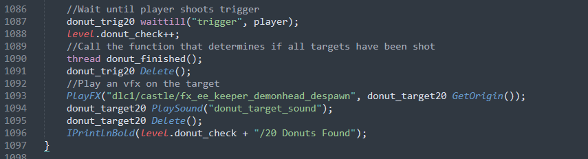
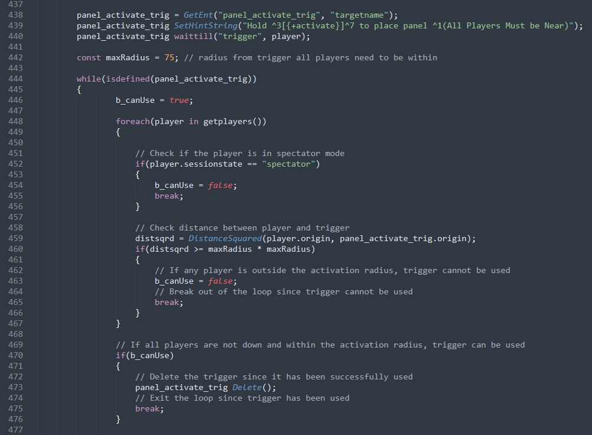
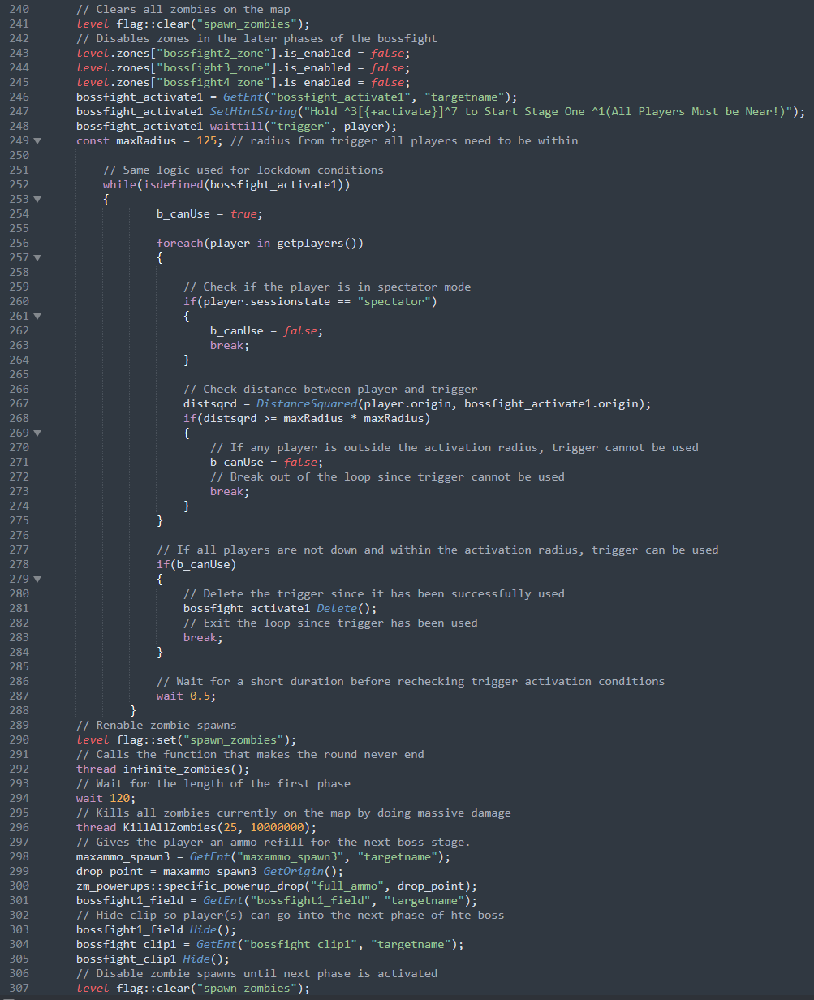

# BO3-GSC-Mod-Library

A collection of custom GSC/CSC gameplay systems, scripting, and level design developed for Call of Duty: Black Ops III Zombies. This repository contains the source code and assets for *Nathan's Donuts and Ethan's Dungeon,* featuring event-driven gameplay, quest systems, interactive mechanics, dynamic lighting, environmental design and custom enemy behavior.

## Level Design & Environmental Lighting

| Ethan's Dungeon: Main Chamber | Ethan's Dungeon: Cavern & Fog |
| :---: | :---: |
|  |  |

### *Nathan's Donuts* — Project Impact
  

| Metric |  Result |
|---|---:|
| Total Players |**6,463+** |
| Player Views |**20,079+** |
| Total Favorites |**258** |
| Positive Rating |**80%** |

## Nathan's Donuts Overview:
*Nathan's Donuts* is a fully playable custom Call of Duty: Black Ops III Zombies map developed using the Black Ops III Mod Tools. I designed and implemented the map's gameplay systems, scripted interactive quests and mechanics, along with custom enemy behavior using GSC.

The quest is structured as a sequence of interconnected objectives, with branching gameplay tasks resulting in a final boss encounter.

 

## Nathan's Donuts — Code Implementations

### Multi-Stage Quest Architecture:

Nathan's Donuts Main Quest is structured as a sequence of interconnected stages, with each stage responsible for a specific objective and progression state. Shared level variables track important conditions, allowing individual systems to determine when their requirements have been met and when the next stage of the quest can be activated.

 

## Event-Driven Gameplay:

Quest progression is driven by player interactions and gameplay events rather than a linear script. Interactive entities wait for player-triggered events, update quest state, and invokes the appropriate progression logic.

 

### Player Lockdown Event:

This lockdown sequence combines player interaction, multiplayer state validation, round-based progression, and environmental events. Before the lockdown beings, the system verifies that every active player is alive and within a defined radius of the activation trigger. once these requirements are met, the area is sealed and players must survive the required rounds, and the environment is updated when the lockdown begins and ends. 

 

### Boss Encounter State Management

The final boss encounter is implemented as a multi-stage scripted system that coordinates player validation, enemy spawning, zone management, timed objectives, and stage transitions. Each stage has its own activation conditions and cleanup logic, allowing the encounter to progress through distinct gameplay phases.

 

### Dynamic Enemy Scripting

### *Nathan's Donuts* Final Boss Gameplay
https://github.com/user-attachments/assets/27906294-3969-4f47-8fc7-24c935eae717

