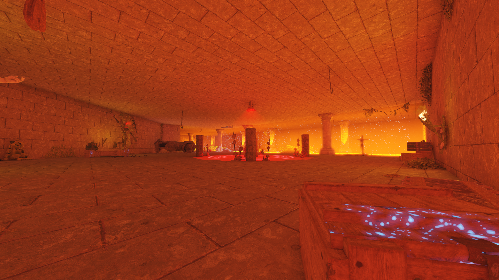
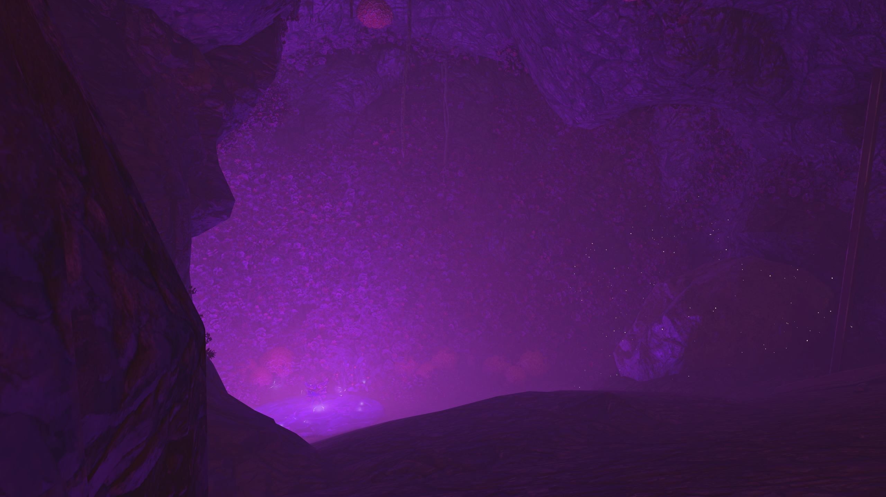

# BO3-GSC-Mod-Library

## Level Design & Environmental Lighting

| Ethan's Dungeon: Main Chamber | Ethan's Dungeon: Cavern & Fog |
| :---: | :---: |
|  |  |

https://github.com/user-attachments/assets/27906294-3969-4f47-8fc7-24c935eae717

This repository contains a collection of all of my custom scripts developed for my Call of Duty Black Ops III Zombies using the GSC language. These files contain code about game logic, game quests, and custom behaviors. Most of the code is written by me, however some credited code is from tutorials and other sources.
